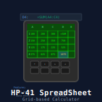

# hp-41_SpreadSheet

[](https://en.wikipedia.org/wiki/HP-41C)
[](https://unlicense.org/)
[](https://github.com/isene/hp-41_SpreadSheet/stargazers)
[](https://isene.org)



Want to have a spreadsheet on your HP-41 calculator? Here's a way.

This program is an advancement of the spredsheet program "MicroCalc" created by Namir Shammas sometimes in the early 1980s (User program #01115C) - adding many features from the CX. It has the basic features you would expect from the usual spreadsheet programs (such as Excel) with any amount of calculations per cell that an HP-41 is capable of (an impressive lot) and the number of cells that you can fit into the calculator memory (in practical terms, a 100 cells).

Each "cell" is an HP-41 register, starting with Register 01. Reg 00 is used by the program to hold the name of the current worksheet and the current cell. A spreadsheet is created by adding a new program labeled simply from 0 to 9 as an Alpha label. The spreadsheet with "LBL '0" (LBL Alpaha 0 Alpha) must hold as many numeric lables as there are cells in the spreadsheet in addition to a LBL 00 that holds the number of columns and rows in the spreadheet. Like this:

```
001*LBL "0"		; This is the program for spreadsheet #0
002 GTO IND X	; MUST ALWAYS BE THE FIRST LINE
003 LBL 00		; Must always have a LBL 00 to define the spreadsheet
004 2			; Two columns
005 3			; Three rows
006 RTN
007 LBL 01		; Here comes the cells that are simple input cells
008 LBL 02		; The labels correspond to the cells/registers that will hold their content
009 LBL 03
010 LBL 05
011 RTN			; The input type cells (no formulas) all just end in a RTN
012 LBL 04		; Here is a cell with a formula
013 RCL 01
014 RCL 02
015 *     
016 STO 04		; Remember to store the result in the cell/register 
017 RTN   
018 LBL 06		; Here is another cell with a formula
019 RCL 02
020 X^2   
021 RCL 03
022 SIN   
023 /     
024 RCL 05
025 +     
026 STO 06		; Remember to store the result in the cell/register 
027 RTN			; Yeah, you can skip this RTN as the END will return just nicely
028 END 
```

The above program is the definition of spreadsheet "0". 

The first number under LBL 00 is the number of columns, the second is the number of rows. The 6 cells are then distributed like this in the spreadsheet:

```
Reg01  Reg02
Reg03  Reg04
Reg05  Reg06
```

All the cells (labels) that are simple "input"-type cells (cells without any calculations) are grouped at the top (after LBL 00) and ends in a simple RTN (indicating no calculations for those cells). Cells that contain calculations (like LBL 04 and 06) contain the calculations as seen in the above example.

Another example to clarify the concept: In a usual spreadsheet, cells are labled A1, B1, C1 across the columns and A1, A2, A3 down the rows. If a cell has a formula (cell A3 = A1 * A2), you first must realize that cell A1 is Register01 (R01) and in your spreadsheet program (for instance "0" - as in LBL"0") it corresponds to LBL 01 - A2 is R02/LBL02, A3 is R03/LBL03, etc. If A1 and A2 are simple input cells with no formulas, it would just have an RTN in your spreadsheet program (see example on the GitHub page), while A3 would have this in the spreadsheet program:

```
LBL 03
RCL 01 ; get A1
RCL 02 ; get A2
* ; multiply
STO 03 ; store the result into the cell register
RTN
```

When you start the main program (XEQ "SHEET") you will be asked to enter the spreadsheet (a number from 0 to 9). You will then see the content of cell 1. Pressing R/S will show the mnemonics for the first row of User Defined Keys (keys A-E). Make sure you have USER pressed to get access to the User Defined Keys. Pressing R/S again shows the mnemonics for the shifted User Defined Keys (keys a-e). Pressing R/S again will get you back to showing the current cell's content. Any time the current cell content is shown, pressing R/S will show you the menu and another R/S will show the shifted menu. The mnemonics (in parenthesis) are:

Label (Menu)    | Description
----------------|------------
LBL A (#)		| Used for numeric input type cells: Input the cell number, then the numeric value and press A to store the value in that cell
LBL B (-c)		| Go to one cell lower and show the content
LBL C (+c)		| Go to one cell higher and show the content
LBL D (+R)      | Go to the cell in next row and show the content (stops at bottom row)
LBL E (V)		| View the content of the current cell (the cell number is in register Y). If you press a cell number and then "E", the current cell will be changed to this number and the content viewed (this is the way to jump to a certain cell)
LBL a (a)		| Used for storing an Alpha value in a cell. Put up to 6 characters in Alpha, the cell number in X and press "a"
LBL b (1)		| Go to first cell and show the content
LBL c (E)		| Go to last cell and show the content
LBL d (-R)      | Go to the cell in higher row and show the content (stops at top row)
LBL e (RS)		| Regenerate & Save; Regenerate all cell contents (applying all formulas), then press R/S when prompted to save the spreadsheet (all cells, including Reg 00) to an XM file named the same as the spreadsheet program (number from 0 to 9)

If you have a spreadsheet saved when you start the main program, it will automatically load the content of all the cells from that XM file.

To show the content of each consequtive cells, run the main program and press "D" and the program will advance one cell at a time and show the content (cell number is always left in register Y), doing calculations for the cells as directed.

## License
This software is released into the Public Domain.
